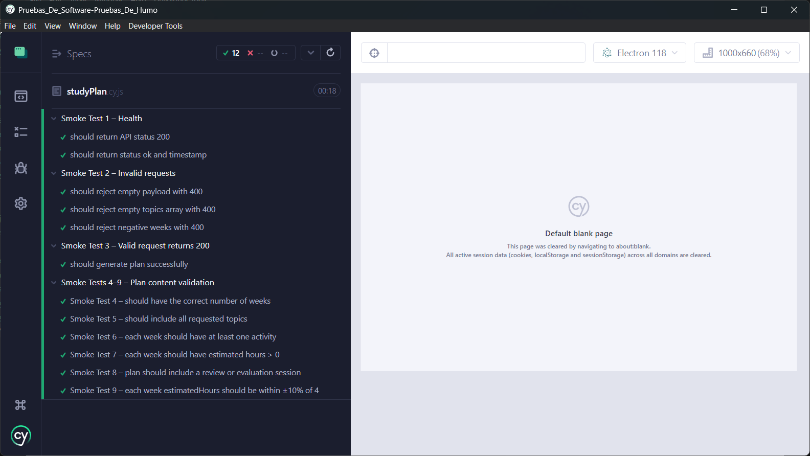
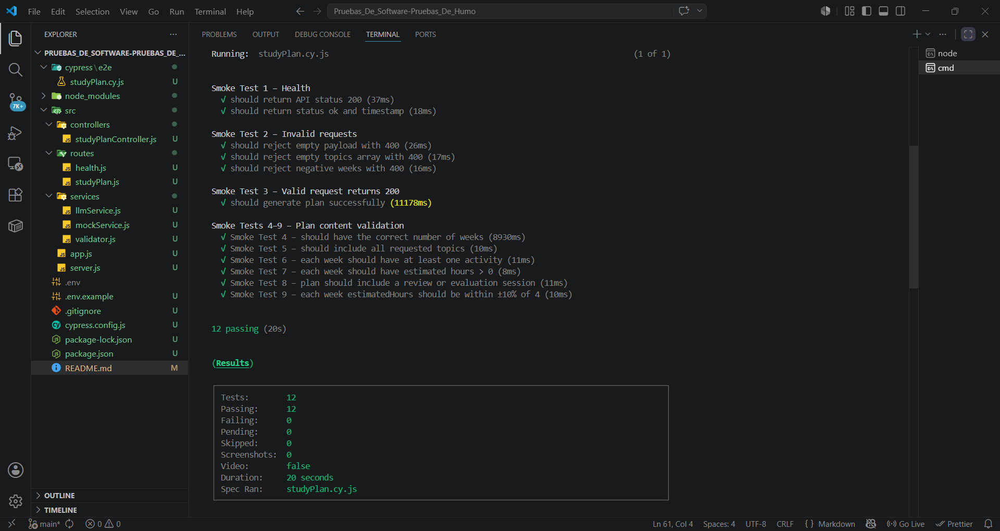

# Study Plan API

API REST que genera planes de estudio personalizados usando un LLM (via OpenRouter). Incluye validaciones de entrada, validaciones de coherencia del plan y smoke tests con Cypress.

**Integrantes:** Billy Martinez, Bastian Lagos  

---

## Stack tecnológico

- **Node.js** + **Express** — servidor HTTP
- **Axios** — cliente HTTP para llamadas a OpenRouter
- **dotenv** — variables de entorno
- **Cypress** — smoke tests end-to-end
- **OpenRouter API** — acceso al LLM (por defecto `openai/gpt-4o-mini`)

---

## Estructura del proyecto

```
project/
├── src/
│   ├── routes/
│   │   ├── health.js
│   │   └── studyPlan.js
│   ├── services/
│   │   ├── validator.js     # Validaciones de request y coherencia del plan
│   │   ├── llmService.js    # Llamada a OpenRouter
│   │   └── mockService.js   # Generador mock (sin API key)
│   ├── controllers/
│   │   └── studyPlanController.js
│   ├── app.js
│   └── server.js
├── cypress/
│   └── e2e/
│       └── studyPlan.cy.js  # 9 smoke tests
├── cypress.config.js
├── .env
├── .env.example
├── package.json
└── README.md
```

---

## Instalación

```bash
npm install
```

---

## Configurar variables de entorno

```bash
cp .env.example .env
```

Editar `.env` con tu API key de OpenRouter:

```
OPENROUTER_API_KEY=sk-or-xxxxxxxxxxxx
OPENROUTER_MODEL=openrouter/owl-alpha
PORT=3000
```

> **Sin API key:** La API funciona en modo mock automáticamente. Los tests de Cypress pasan sin necesidad de OpenRouter.

---

## Ejecutar la API

```bash
# Desarrollo (con nodemon)
npm run dev

# Producción
npm start
```

La API queda disponible en `http://localhost:3000`.

---

## Endpoints

### `GET /health`

Verifica el estado de la API.

**Respuesta:**
```json
{
  "status": "ok",
  "llm": "connected",
  "timestamp": "2026-06-01T18:00:00Z"
}
```

---

### `POST /study-plan`

Genera un plan de estudios.

**Request:**
```json
{
  "topics": ["Introducción", "Variables", "Funciones", "POO"],
  "weeks": 4,
  "hoursPerWeek": 6,
  "startDate": "2026-06-10"
}
```

| Campo | Tipo | Requerido | Descripción |
|-------|------|-----------|-------------|
| `topics` | string[] | ✅ | Lista de temas a cubrir |
| `weeks` | number | ✅ | Duración en semanas (> 0) |
| `hoursPerWeek` | number | ✅ | Horas semanales (> 0) |
| `startDate` | string | ❌ | Fecha de inicio (ISO 8601) |

**Respuesta exitosa (200):**
```json
{
  "generatedBy": "llm",
  "generatedAt": "2026-06-01T18:00:00Z",
  "weeks": [
    {
      "week": 1,
      "topics": ["Introducción"],
      "activities": ["Lectura introductoria", "Ejercicios básicos"],
      "estimatedHours": 6
    }
  ]
}
```

**Respuesta de error (400):**
```json
{
  "error": "weeks must be greater than 0"
}
```

---

## Validaciones

### Del request (400 Bad Request)
- `topics` requerido y no vacío
- `weeks` requerido y mayor a 0
- `hoursPerWeek` requerido y mayor a 0

### De coherencia del plan (422 Unprocessable Entity)
- Número de semanas coincide con el solicitado
- Todos los tópicos están cubiertos
- Cada semana tiene al menos una actividad
- Cada semana tiene estimación de horas > 0
- Existe al menos una sesión de repaso o evaluación
- Carga horaria dentro del ±10% por semana

---

## Ejecutar Cypress (smoke tests)

Con la API corriendo en otra terminal:

```bash
# Headless (CI)
npx cypress run

# Con interfaz gráfica
npx cypress open
```

### Tests incluidos

| # | Descripción |
|---|-------------|
| 1 | Health endpoint retorna 200 |
| 2 | Solicitudes inválidas retornan 400 |
| 3 | Solicitud válida retorna 200 |
| 4 | Número de semanas correcto |
| 5 | Todos los tópicos presentes |
| 6 | Cada semana tiene actividades |
| 7 | Cada semana tiene horas estimadas |
| 8 | Plan incluye repaso o evaluación |
| 9 | Carga horaria dentro de ±10% |

### Evidencias
#### Cypress UI

---
#### Cypress Console

---

## Modo Mock vs LLM

| Condición | Comportamiento |
|-----------|---------------|
| Sin `OPENROUTER_API_KEY` | Modo mock automático |
| `USE_MOCK=true` en `.env` | Fuerza modo mock |
| Con API key válida | Llama a OpenRouter |

Esto permite desarrollar y testear sin costo de API.


